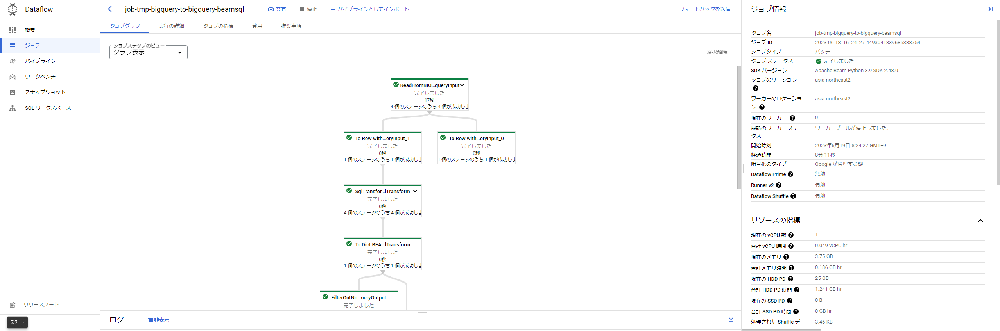

# PyDataflow Template

PyDataflow Template is an ETL tool that uses [Cloud Dataflow](https://cloud.google.com/dataflow). It is implemented as a [FlexTemplate](https://cloud.google.com/dataflow/docs/guides/templates/using-flex-templates) for Dataflow.

By defining a JSON configuration file, you can execute various pipelines without the need for programming. The pipeline is assembled based on the configuration file and executed as a Cloud Dataflow or Direct Runner job.

This project is implemented in Python as an alternative to the Java-based project [DataflowTemplate](https://github.com/mercari/DataflowTemplate), which you can refer to. (The number of modules is still limited.)

The three types of modules, `sources`, `transforms`, and `sinks`, are abstracted as the entities that perform Extract, Transform, and Load operations, respectively. Each module is a class that implements an Apache Beam Ptransform. By combining modules, you can construct flexible ETL pipelines.

## Usage Example

The following configuration file is an example of saving the result of a MySQL query to a specified table in BigQuery.

```json
{
  "name": "mysql-to-bigquery",
  "description": "Sample data load from MySQL to BigQuery.",
  "sources": [
    {
      "name": "mysqlInput",
      "module": "mysql",
      "parameters": {
        "query": "select * from test_db.test;",
        "profile": "test_mysql"
      }
    }
  ],
  "sinks": [
    {
      "name": "bigqueryOutput",
      "module": "bigquery",
      "input": "mysqlInput",
      "parameters": {
        "table": "py-dataflow:test.mysql_to_bigquery_sample_output",
        "create_disposition": "CREATE_IF_NEEDED"
      }
    }
  ]
}
```

To execute the command using the created configuration file, run the following command:

```sh
make run_workflow config=path/to/config.json
```

Dataflow jobs will be started via Workflows. You can check the execution status of the jobs on the console screen.



For more details, please refer to the [documentation](docs/README.md).
