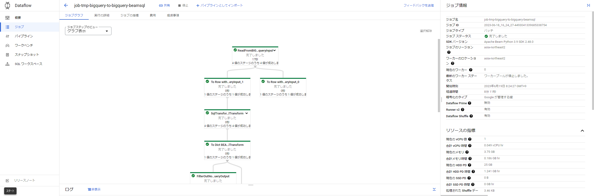

# PyDataflow Template

PyDataflow Template は、[Cloud Dataflow](https://cloud.google.com/dataflow) を使った ETL ツールです。 Dataflow の[FlexTemplate](https://cloud.google.com/dataflow/docs/guides/templates/using-flex-templates) として実装しています。

JSON 構成ファイルを定義することで、プログラミング不要で様々なパイプラインを実行できます。構成ファイルに基づいてパイプラインを組み立て、Cloud Dataflow または Direct Runner ジョブとして実行します。

以下のリポジトリを参考にし、Java のかわりに Python で実装しています。（まだモジュールの数は少ないですが）
https://github.com/mercari/DataflowTemplate

`sources`, `transforms`, `sinks`3 種類のモジュールがそれぞれ Extract、Transform、Load を実行する主体として抽象化されています。各モジュールは、Apache Beam の Ptransform を実装したクラスです。モジュールを組み合わせることで柔軟に ETL パイプラインを構成できます。

## 使用例

以下の構成ファイルは、MySQL のクエリ結果を BigQuery で指定されたテーブルに保存する例です。

```json
{
  "name": "mysql-to-bigquery",
  "description": "Sample data load from MySQL to BigQuery.",
  "sources": [
    {
      "name": "mysqlInput",
      "module": "mysql",
      "parameters": {
        "query": "select * from test_db.test;",
        "profile": "test_mysql"
      }
    }
  ],
  "sinks": [
    {
      "name": "bigqueryOutput",
      "module": "bigquery",
      "input": "mysqlInput",
      "parameters": {
        "table": "py-dataflow:test.mysql_to_bigquery_sample_output",
        "create_disposition": "CREATE_IF_NEEDED"
      }
    }
  ]
}
```

作成した構成ファイルを指定して、以下のコマンドを実行します。

```sh
make run_workflow config=path/to/config.json
```

Workflows 経由で Dataflow ジョブが開始されます。コンソール画面でジョブの実行状態を確認できます。



詳細については、[ドキュメント](docs/README_ja.md) を参照してください。
