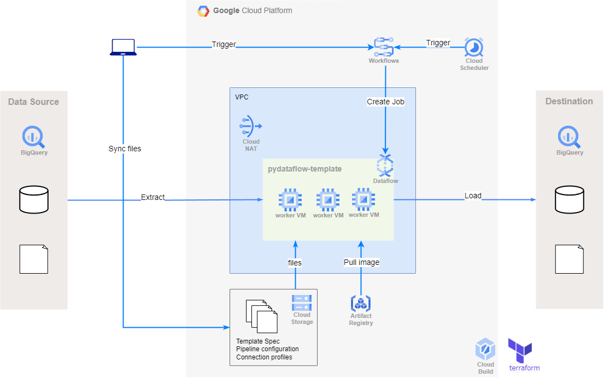

# アーキテクチャ構成



# 0. Prerequisite

1.  OS: Linux(Ubuntu)
1.  Python(3.8-3.10)
1.  Google Cloud SDK
1.  Terraform
1.  docker
1.  docker-compose
1.  (Optional) Java runtime : 一部のモジュールで必要

Python 仮想環境のセットアップ

```bash
poetry install
```

# 1. インフラ構築、ビルド・デプロイ

## 1.1. GCP プロジェクトの作成と認証情報の設定

```bash
gcloud projects create <PROJECT_ID> --name <PROJECT_NAME>
gcloud config set project <PROJECT_ID>
gcloud auth login
```

## 1.2. terraform によるインフラ構築

terraform/terraform.tfvars に必要な値を設定する。

```
gcp_project_id = "<GCP_PROJECT_ID>"
region = "asia-northeast2"
gcp_project_name = "<GCP_PROJECT_NAME>"
gcp_billing_account_id = "<GCP_BILLING_ACCOUNT_ID>"
gcs_bucket_name = "py-dataflow-bucket"
gcs_temp_folder = "pydataflow-temp/"
repository_name = "pydataflow-repo"
dataflow_worker_service_account = ""
use_externally_managed_dataflow_sa = false
workflows_service_account = ""
use_externally_managed_workflows_sa = false
```

コマンドを実行する

```bash
cd terraform/
terraform init
terraform import google_project.project <PROJECT_ID>
terraform plan
terraform apply
```

## 1.3. Dataflow のビルド・デプロイ

Dataflow と Workflows は、gcloud コマンドで作成する。

Makefile で必要な変数を定義する

| 変数名                  | 説明                                    |
| :---------------------- | :-------------------------------------- |
| WORKER_IMAGE_NAME       | 任意の Docker イメージ名 (worker)       |
| FLEXTEMPLATE_IMAGE_NAME | 任意の Docker イメージ名 (flextemplate) |
| BEAM_VERSION            | Apache Beam SDK バージョン              |

make コマンドでビルド・デプロイする

```bash
make build_dataflow

#  実行されるコマンド
#	gcloud builds submit \
#		--config cloudbuild/cloudbuild_dataflow.yaml \
#		--substitutions=_PROJECT_ID=${GCP_PROJECT_ID},_FLEXTEMPLATE_IMAGE=${FLEXTEMPLATE_IMAGE},_TEMPLATE_PATH=${GCS_PATH_CONTAINER_SPEC},_WORKER_IMAGE=${WORKER_IMAGE},_METADATA_FILE=${METADATA_FILE},_BEAM_VERSION=${BEAM_VERSION}
```

## 1.4. Workflows のビルド・デプロイ

Makefile で必要な変数を定義する

| 変数名        | 説明                 |
| :------------ | :------------------- |
| WORKFLOW_NAME | 任意のワークフロー名 |

make コマンドでビルド・デプロイする

```bash
make build_workflow

#  実行されるコマンド
#	gcloud builds submit \
#		--config cloudbuild/cloudbuild_workflow.yaml \
#		--substitutions=_LOCATION=${REGION},_WORKFLOW_NAME=${WORKFLOW_NAME},_WORKFLOW_CONFIG_YAML=${WORKFLOW_CONFIG_YAML},_WORKFLOW_SERVICE_ACCOUNT=${WORKFLOW_SERVICE_ACCOUNT}
```

---

# 2. ジョブの実行

## 2.1. JSON 構成ファイルの定義

Dataflow ジョブの設定を JSON 構成ファイルに定義

詳細については、[Define Pipeline](config/README_ja.md) を参照してください。

## 2.2. Workflows 経由で Dataflow ジョブを実行

Workflows を介して Dataflow のジョブを起動する。ジョブ起動時に JSON 構成ファイルをパラメーターとして渡すことで、定義したパイプラインを動的に実行できる。

Makefile で必要な変数を定義する

| 変数名           | 説明                                                    |
| :--------------- | :------------------------------------------------------ |
| profile [1]      | DB への接続プロファイル情報を記述した JSON ファイルパス |
| NUM_WORKERS      | デフォルトワーカー数                                    |
| MAX_WORKERS      | 最大ワーカー数                                          |
| MACHINE_TYPE [2] | マシンタイプ                                            |
| POLLING_SECONDS  | ジョブステータスのポーリング間隔(s)                     |

[1] 例えば profile=.connections.json などとしてパスをする。JSON ファイルの書き方は[ここなど](config/module/source/mysql_ja.md)を参照。

[2]
Apache Beam において、[分散処理の単位になるのは DoFn クラス](https://cloud.google.com/dataflow/docs/guides/troubleshoot-oom?#dofn)であり、Python の SDK の場合、SDK のプロセスは vCPU のコア毎に存在し、複数のスレッドから共有される。
バッチの場合、vCPU コアあたり実行できる DoFn インスタンスの最大数は 1 で、1 スレッドが DoFn インスタンスを実行する。そのため、バッチに限れば、コア数=並列数となる。並列数が多い場合（データ量が多いテーブル）、コア当たりの料金が安い E2 シリーズでよいが、1 コアで十分な場合（データ量が少ないテーブル）、1 コア～のラインナップがある n1-standard-1（バッチのデフォルト）が有利となる。必要に応じてマシンタイプは切り替えられるが、料金は主にデータ量が多いテーブルに影響されると考えられるので、デフォルトでは e2-standard-2 としている。

make コマンドの起動時引数として JSON 構成 ファイルを指定して実行する

```bash
make run_workflow config=path/to/config.json

#  実行されるコマンド
#	gcloud workflows execute ${WORKFLOW_NAME} \
#		--data='{"config": "${GCS_PATH_JOB_CONFIG_JSON}", "profile": "${GCS_PATH_CONNECTION_PROFILES_JSON}", "gcs_temp_folder": "${GCS_TEMP_FOLDER}", "containerSpecGcsPath": "${GCS_PATH_CONTAINER_SPEC}", "workerContainerImage": "${WORKER_IMAGE}", "numWorkers": ${NUM_WORKERS}, "maxWorkers": ${MAX_WORKERS}, "machineType": "${MACHINE_TYPE}", "subnetwork": "${SUBNETWORK}", "region": "${REGION}"}' \
#		--location ${REGION}
```

### [Note]

JSON 構成 ファイルのパスは**相対パスを指定**して下さい。理由は、リポジトリの `configs/` `examples/` ディレクトリを GCS の指定バケットと自動で同期する設定にしているためです。Dataflow のジョブは GCS に同期された構成 JSON ファイルを参照してジョブを実行します。

[example]

```bash
# @repository top
# OK.
make run_workflow config=configs/path/to/config.json
# NG.
make run_workflow config=gs://bucket_name/configs/path/to/config.json
```

## 2.3. ローカルマシンでジョブ実行(Direct Runner による小規模データの処理)

流れは 2.2. と同じ。

```bash
make run_local config=path/to/config.json
```

---

# 3. ジョブの定期実行

Workflows を定期的に実行する Cloud scheduler のトリガーを作成する。Workflows 呼び出し時に JSON 構成ファイルをパラメータとして POST することで、定義したジョブを実行する。

## 3.1. JSON 構成ファイルに設定を記述

```json
{
  "schedule": {
    "name": "scheduler-job-name",
    "cron": "0 0 * * *",
    "enable": "false"
  }
}
```

| parameter | description                         |
| :-------- | :---------------------------------- |
| name      | トリガーの名前を指定                |
| cron      | cron 形式で頻度を指定               |
| enable    | 有効化するか否か(`true` or `false`) |

## 3.2. make コマンドでトリガーを作成/更新/削除

```bash
make trigger_workflow config=path/to/config.json
```

トリガーの作成/更新/削除のロジック

- enable==true && name に指定されたトリガーが既に存在する：更新
- enable==true && name に指定されたトリガーがまだ存在しない：作成
- enable==false && name に指定されたトリガーが既に存在する：削除
- それ以外：何もしない

# 4. 主要な make コマンド

インフラ構築やジョブの実行コマンド以外にも、テストや静的解析などの開発用コマンドも用意してあります。以下のコマンドで一覧を確認できます。

```bash
make help

# Example operations by Makefile.

# Usage: make SUB_COMMAND argument_name=argument_value

# Command list:

# [Sub command]                  [Description]                                      [Example]
# build_all                      build and deploy dataflow and workflow             make build_all
# build_dataflow                 build and deploy dataflow                          make build_dataflow
# build_workflow                 build and deploy workflow                          make build_workflow
# run_workflow                   run beam job via workflow in dataflow              make run_workflow config=relative/path/to/config.json
# run_local                      run beam job in local machine using direct runner  make run_local config=relative/path/to/config.json
# sync_config_to_storage         sync configs/ examples/ with GCS                   make sync_config_to_storage
# set-project                    Check project existence and create if not found.   make check-project
# unit-test                      unit test                                          make unit-test
# integration-test               integration test                                   make integration-test
# tox                            test in multiple python versions                   make tox
# lint                           lint                                               make lint
# format                         format                                             make format
# isort                          isort                                              make isort
# type_check                     type_check                                         make type_check
# static_test                    static_test                                        make static_test
# help                           print this message
```

# TODO

## 機能

- モジュール追加 (Data source, Transform, ML ...etc.)
- ストリーミング対応
- 構成ファイルの yaml 対応
- 簡易画面作成（streamlit とか?）
- タイムゾーン変換対応

## 実装

- Incremental mode の merge の実装を追加
- Dataflow ジョブ名を構成ファイルの名前にしている箇所の再考
- プリミティブ型をクラス化、バリデーションロジックをクラスにカプセル化
- 継承箇所をコンポジション(Decorator)に直す。
- CI/CD 設定
- workflows のジョブステータス監視をポーリング->コールバックに変更
- Incremental モードでの SQL の書き換えで、CTE を使った形に変更
- Integration test 高速化
